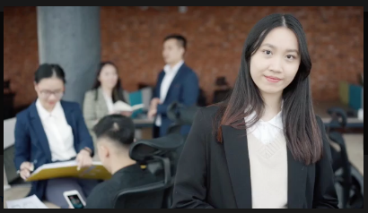

OpenAI ChatGPT Prompt Collection (プロンプトコレ)
===========

This repository is a collection of useful custom prompts for [OpenAI ChatGPT](https://openai.com/blog/chatgpt).

---
このリポジトリは、`OpenAI ChatGPT`の便利なカスタム プロンプトのコレクションです。

 

# Motivation

The rise of `large language models` (LLMs) such as `ChatGPT` has made them indispensable in various industries. `Prompt engineering` is a crucial aspect of utilizing these models effectively. It involves crafting well-designed prompts to produce the desired output. With LLMs like `ChatGPT` generating similar results based on the prompt, this skill is becoming increasingly important for developers.

However, not everyone has the expertise or time to create custom prompts. This is where a prompt repository comes in handy. It offers a collection of prompts that can be easily accessed for various purposes, serving as a starting point for developers to tweak and fine-tune to obtain the desired outcome. In this way, prompt engineering can be made more accessible and streamlined, allowing for more efficient and effective use of LLMs.

---
大型言語モデル（LLMs）、例えば`ChatGPT`は、さまざまな業界でますます有用となっています。`プロンプトエンジニアリング`は、これらのモデルを効果的に使用するための重要な側面です。これは、望ましい出力を生成するように適切に設計されたプロンプトを作成することを含みます。同じプロンプトに基づいて同様の結果を生成するLLMs（`ChatGPT`など）があるため、このスキルは開発者にとってますます重要になっています。

しかし、すべての人がカスタムプロンプトを作成する専門知識や時間を持っていない場合もあります。ここでプロンプトリポジトリが役立つのです。これは、さまざまな目的のために簡単にアクセスできるプロンプトのコレクションを提供し、開発者がこれらを調整して望ましい結果を得る起点となります。このように、プロンプトエンジニアリングはよりアクセス可能でストリーミングされ、より効率的で効果的なLLMsの使用が可能となります。

 

# Write Script for Advertisement

Here is a sample prompt if you want `ChatGPT` to write a script for video advertisement.

 

> `write a Japanese script for an advertisement film with a focus on storytelling for a real estate property management company named House with emphasis on being trustworthy and affordability.`

 

 
To implement this into an actual video, I will be using the following:

* [Pexels](https://pexels.com), the best free stock photos and videos
* [FreeTTS](https://freets.com), awesome text to speech to MP3 converter
* [Apple iMovie](https://www.apple.com/imovie), powerful macOS video editor
* [Streamable](https://streamable.com/), for super clean video publishing on the web

 

Here's the final video (click the image):

