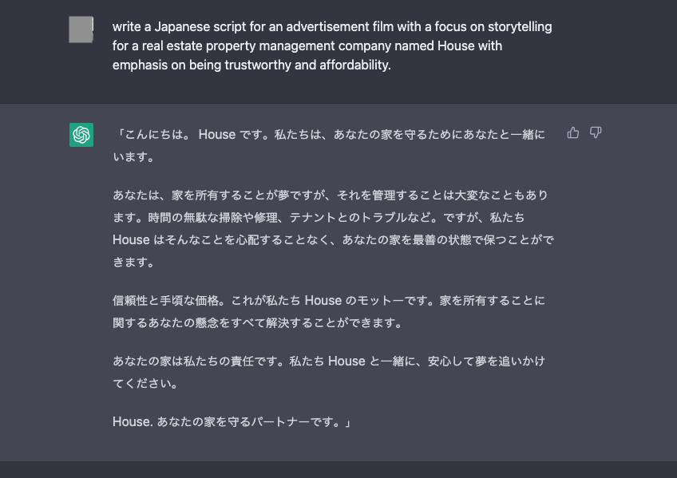

OpenAI ChatGPT Prompt Collection (プロンプトコレ)
===========

This repository is a collection of useful custom prompts for [OpenAI ChatGPT](https://openai.com/blog/chatgpt).

---
このリポジトリは、`OpenAI ChatGPT`の便利なカスタム プロンプトのコレクションです。

 

# Contents
  * <a href="#motivation">Motivation</a>
  * <a href="#write_script">1. [Content Creation] Write Script for an Ad / CMナレションを書く</a>
  * <a href="#analyze_email">2. [Data Analysis] Extract and Analyze Valuable Insights from Email / メールデータから貴重な洞察を抽出・分析する方法</a>
  * <a href="#write_post">3. [Content Creation] Create Engaging Social Media Post for Marketing / マーケティングのための魅力的なSNS投稿を作成する</a>
  * <a href="#analyze_comment">4. [Sentiment Analysis] Analyze User Comment in Social Media  / SNSでユーザーコメントを分析します</a>
  * <a href="#q&a-test">5. [Q&A] Act as Interviewer for a Personality Test / 性格検査の試験監督を務める</a>
  * <a href="#references">References</a>

 

# Motivation

The rise of `large language models` (LLMs) such as `ChatGPT` has made them indispensable in various industries. `Prompt engineering` is a crucial aspect of utilizing these models effectively. It involves crafting well-designed prompts to produce the desired output. With LLMs like `ChatGPT` generating similar results based on the prompt, this skill is becoming increasingly important for developers.

However, not everyone has the expertise or time to create custom prompts. This is where a prompt repository comes in handy. It offers a collection of prompts that can be easily accessed for various purposes, serving as a starting point for developers to tweak and fine-tune to obtain the desired outcome. In this way, prompt engineering can be made more accessible and streamlined, allowing for more efficient and effective use of LLMs.

---
大型言語モデル（LLMs）、例えば`ChatGPT`は、さまざまな業界でますます有用となっています。`プロンプトエンジニアリング`は、これらのモデルを効果的に使用するための重要な側面です。これは、望ましい出力を生成するように適切に設計されたプロンプトを作成することを含みます。同じプロンプトに基づいて同様の結果を生成するLLMs（`ChatGPT`など）があるため、このスキルは開発者にとってますます重要になっています。

しかし、すべての人がカスタムプロンプトを作成する専門知識や時間を持っていない場合もあります。ここでプロンプトリポジトリが役立つのです。これは、さまざまな目的のために簡単にアクセスできるプロンプトのコレクションを提供し、開発者がこれらを調整して望ましい結果を得る起点となります。このように、プロンプトエンジニアリングはよりアクセス可能でストリーミングされ、より効率的で効果的なLLMsの使用が可能となります。

 

# 1. [Content Creation] Write Script for an Ad / CMナレションを書く

Prompt taken from this video, [This entire Ad was written by ChatGPT (for ChatGPT)](https://www.youtube.com/watch?v=eTjpGBur7uE).

**Prompt:**
> write a script for an advertisement film with a focus on storytelling for <Insert_Description_Here>.

**Example Usage:**
> write a `Japanese` script for an advertisement film with a focus on storytelling for `a real estate property management company named House with emphasis on being trustworthy and affordability`.

**Output:**
>「こんにちは。 House です。私たちは、あなたの家を守るためにあなたと一緒にいます。
>
> あなたは、家を所有することが夢ですが、それを管理することは大変なこともあります。時間の無駄な掃除や修理、テナントとのトラブルなど。ですが、私たち House はそんなことを心配することなく、あなたの家を最善の状態で保つことができます。
>
> 信頼性と手頃な価格。これが私たち House のモットーです。家を所有することに関するあなたの懸念をすべて解決することができます。
>
> あなたの家は私たちの責任です。私たち House と一緒に、安心して夢を追いかけてください。
>
> House. あなたの家を守るパートナーです。」

**Screenshot:**

 
To implement this into an actual video, I will be using the following:

* [Pexels](https://pexels.com), the best free stock photos and videos
* [FreeTTS](https://freets.com), awesome text to speech to MP3 converter
* [Apple iMovie](https://www.apple.com/imovie), powerful macOS video editor
* [Streamable](https://streamable.com/), for super clean video publishing on the web

 

Here's the final video: [click here](https://streamable.com/9cb5cr).

 

**Video Credits:**

Video by MART  PRODUCTION from Pexels: 
* https://www.pexels.com/video/family-dancing-in-a-new-home-7347751/
* https://www.pexels.com/video/family-just-moved-playing-with-the-boxes-7347587/

Video by Kindel Media from Pexels: 
* https://www.pexels.com/video/businesspeople-working-together-7652002/
* https://www.pexels.com/video/businessmen-shaking-hands-7688001/

Video by Mikhail Nilov from Pexels: 
* https://www.pexels.com/video/a-woman-smiling-and-posing-in-the-camera-while-people-are-working-behind-her-8102924/
* https://www.pexels.com/video/people-working-together-7683053/

Video by Mikael Blomkvist from Pexels: 
* https://www.pexels.com/video/man-and-a-woman-working-at-a-construction-site-8965436/

Video by Ivan Samkov from Pexels: 
* https://www.pexels.com/video/boy-giving-a-painting-woman-a-glass-of-water-to-drink-5799479/

Video by cottonbro studio from Pexels: 
* https://www.pexels.com/video/house-apartment-home-clean-4109343/

Video by Tima Miroshnichenko from Pexels: 
* https://www.pexels.com/video/man-using-smartphone-6474150/

Video by Thirdman from Pexels: 
* [https://www.pexels.com/video/two-women-working-together-7653223/

 

# 2. [Data Analysis] Extract and Analyze Valuable Insights from Email / メールデータから貴重な洞察を抽出・分析する方法

**Prompt:**
> Write a summary of the email below, highlighting the key points and the sender’s intention. Then, generate three possible email responses that are polite, concise and relevant. The tone should be business-like as it will be used to process company correspondence.
> 
> Email:
> 
> <Insert_Email_Here>.

**Example Usage:**
> Write a summary of the email below, highlighting the key points and the sender’s intention. Then, generate three possible email responses that are polite, concise and relevant. The tone should be business-like as it will be used to process company correspondence.
>
> Email:
> 
> Subject: Request for a meeting
>
> Hi John,
>
> I hope this email finds you well. I am writing to you on behalf of ABC Inc., a leading provider of cloud-based solutions for small and medium businesses. We are interested in exploring a potential partnership with your company, XYZ Ltd., as we believe our products and services can complement each other and create value for both parties.
>
> We would like to request a meeting with you to discuss this opportunity in more detail. Please let us know your availability for next week and the best way to contact you. We are flexible on the time and the format of the meeting, whether it is online or in person.
>
> We look forward to hearing from you soon and hope to establish a fruitful collaboration with you.
>
> Best regards,
>
> Jane Smith Business Development Manager ABC Inc.

**Output:**
> Summary: Jane Smith, the Business Development Manager of ABC Inc., is writing to John to request a meeting with him on behalf of her company. The purpose of the meeting is to explore a potential partnership between ABC Inc. and John's company, XYZ Ltd. They believe that their products and services can complement each other and create value for both parties.
>
> Key points:
>
> Jane is writing on behalf of ABC Inc.
> * They are interested in a potential partnership with XYZ Ltd.
> * They want to request a meeting to discuss the opportunity in more detail.
> * They are flexible on the time and format of the meeting.
>
> Sender's intention: Jane is requesting a meeting with John to discuss a potential partnership between their companies.
>
> Possible responses:
>
> 1. Hi Jane,
Thank you for your email and your interest in a potential partnership between our companies. I am available next week for a meeting to discuss this opportunity in more detail. An online meeting would be preferable for me. Could you please let me know the date and time that works best for you?
Best regards,
John
>
> 2. Hi Jane,
Thanks for reaching out to me on behalf of ABC Inc. I appreciate your interest in exploring a potential partnership with our company. Unfortunately, I am not available next week, but I can offer a time the following week. Would that work for you? Also, an online meeting is more convenient for me.
Best regards,
John
>
> 3. Hi Jane,
Thank you for your email and the interest you have expressed in a partnership with our company. I am available for a meeting next week, and I'm open to either an online or in-person format. Let me know what you think is best, and I'll schedule it on my calendar.
Best regards,
John

 

**Another Example Usage:**

What if the email is in another language?

> Write a summary of the email below, highlighting the key points and the sender’s intention. Then, generate three possible email responses that are polite, concise and relevant. The tone should be business-like as it will be used to process company correspondence.
>
> Email:
>
> 件名：ミーティングのご依頼
>
> ジョン様
>
> お元気でいらっしゃいますか。ABC社のビジネス開発マネージャーのジェーン・スミスと申します。ABC社は、中小企業向けのクラウドベースのソリューションを提供する業界のリーダーです。私たちは、XYZ社とのパートナーシップを検討したいと考えております。私たちの製品とサービスはお互いに補完し合い、双方に価値を創造できると信じております。
> 
> この機会について詳しくお話しできればと思いますので、ミーティングのご依頼をさせていただきます。来週のご都合とご連絡先をお知らせください。ミーティングの時間や形式は、オンラインでも対面でも構いませんので、柔軟に対応いたします。
> 
> 近日中にご返信いただけることを楽しみにしております。貴社との有意義な協力関係を築けることを願っております。
>
> 敬具
>
> ジェーン・スミス ビジネス開発マネージャー ABC社

**Output:**
> Summary: Jane Smith, the Business Development Manager of ABC Inc., is writing to John to request a meeting on behalf of her company. The purpose of the meeting is to explore a potential partnership between ABC Inc. and John's company, XYZ Ltd. They believe that their products and services can complement each other and create value for both parties.
>
> Key points:
>
> Jane is writing on behalf of ABC Inc.
> * They are interested in a potential partnership with XYZ Ltd.
> * They want to request a meeting to discuss the opportunity in more detail.
> * They are flexible on the time and format of the meeting.
>
> Sender's intention: Jane is requesting a meeting with John to discuss a potential partnership between their companies.
>
> Possible responses:
>
> 1. ジェーン様へ
この度はABC社と弊社のパートナーシップにご興味をいただき、誠にありがとうございます。来週のミーティングに参加することが可能です。オンラインでのミーティングが望ましいです。最適な日時をお知らせください。
敬具
ジョン
>
> 2. ジェーン様へ
ABC社からのご連絡、ありがとうございます。今週はスケジュールがいっぱいで来週になりますが、ミーティングの時間を提供できます。オンラインでのミーティングを希望しております。よろしければ、来週いつがよろしいでしょうか。
敬具
ジョン
>
> 3. ジェーン様へ
お返事が遅くなってしまい申し訳ありません。ABC社とのパートナーシップについてご興味をいただき、ありがとうございます。来週のミーティングに参加することができます。オンラインか対面、どちらでも構いません。ご都合のよろしい日時を教えていただければ、カレンダーに予定を追加します。
敬具
ジョン

If you are an expat in Japan, working at a local company, this might be useful.
But what if you are a Japanese? So let's update the prompt:

> Write a summary of the email below, highlighting the key points and the sender’s intention. Then, generate three possible email responses that are polite, concise and relevant. The tone should be business-like as it will be used to process company correspondence. `All outputs should be in Japanese.`

**Output:**
> Summary:
> >
> ABC社のジェーン・スミスから、XYZ社とのパートナーシップを検討している旨を伝え、ミーティングのご依頼をしている。ミーティングの時間や形式は、オンラインでも対面でも柔軟に対応可能であると伝えている。
>
> Key points:
>
> * ABC社は中小企業向けのクラウドベースのソリューションを提供する業界のリーダー
> * XYZ社とのパートナーシップを検討している
> * ミーティングのご依頼をしており、時間や形式は柔軟に対応可能である
>
> Possible responses:
>
> 1. ご連絡いただきありがとうございます。来週の月曜日から水曜日のいずれかであればご都合がよろしいのですが、いかがでしょうか。ミーティングはオンラインで行いたいと思います。
>
> 2. お忙しい中、ご連絡いただきありがとうございます。来週は金曜日のみご都合がよろしいのですが、それでもよろしければお会いしてお話しできればと思います。ミーティングの形式は、対面でお願いいたします。
>
> 3. ご連絡いただきありがとうございます。誠に恐れ入りますが、来週は締め切りが迫っており、ミーティングに参加することができない可能性が高いため、再度ご連絡いただけますでしょうか。可能であれば、2週間後以降に調整可能な日程をお伺いできますでしょうか。

 

# 3. [Content Creation] Create Engaging Social Media Post for Marketing / マーケティングのための魅力的なSNS投稿を作成する

**Prompt:**
> Write a social media post for a business given the following details:
> 
> Event: <Insert_Event>
> 
> Dates: <Insert_Inclusive_Dates>
> 
> Place: <Insert_Location>
> 
> Type of Company/Shop: <Insert_Type_of_Business>
> 
> Target Customers: <Insert_Target_Audience>
> 
> Make the tone cheerful and appropriate for the target customers but make it remain business like. I want you to give me at least 3 examples that I can choose from.

**Example Usage:**
> Write a social media post for a business given the following details:
> 
> Event: `Discount sale for selected products`
> 
> Dates: `from April 1 to April 15, 2023`
> 
> Place: `Maruyama branch shop`
> 
> Type of Company/Shop: `cosmetics, health items, etc.`
> 
> Target Customers: `office ladies, mothers`
> 
> Make the tone cheerful and appropriate for the target customers but make it remain business like. I want you to give me at least 3 examples that I can choose from.

**Output:**
> Example 1:
> 
> Get ready to shine, office ladies and super moms! Our Maruyama branch shop is having a special discount sale from April 1 to April 15, 2023. Enjoy huge discounts on our amazing selection of cosmetics, health items, and more! Don't miss out on this opportunity to stock up on your favorites and treat yourself to some much-needed pampering. Visit us now at Maruyama branch shop!
> 
> 
> Example 2:
> 
> Hey there, hardworking ladies! We know you deserve the best, which is why we're excited to announce our exclusive discount sale from April 1 to April 15, 2023, at our Maruyama branch shop. With amazing deals on cosmetics, health items, and more, this is your chance to indulge in some self-care and refresh your beauty routine. Come and see us at Maruyama branch shop and get ready to feel amazing!
> 
> 
> Example 3:
> 
> Calling all office ladies and super moms! Our Maruyama branch shop is hosting a fantastic discount sale from April 1 to April 15, 2023. Enjoy incredible savings on our top-quality cosmetics, health items, and much more. Whether you're looking to refresh your beauty routine or stock up on essentials, we've got you covered. Head over to Maruyama branch shop and take advantage of this limited-time offer before it's gone!

 

# 4. [Sentiment Analysis] Analyze User Comment in Social Media  / SNSでユーザーコメントを分析します

**Prompt:**
> Based on the social media post below, do a sentiment analysis on the user comment provided: negative, positive or neutral, and show possible action to do: reply, delete or do nothing. If reply is needed, give an example of appropriate reply that is polite.
>
> Post:
> <Insert_post_here>
>
> Comment:
> <Insert_comment_here>

**Example Usage:**

Using our previous example, let say we have this post:
> Get ready to shine, office ladies and super moms! Our Maruyama branch shop is having a special discount sale from April 1 to April 15, 2023. Enjoy huge discounts on our amazing selection of cosmetics, health items, and more! Don't miss out on this opportunity to stock up on your favorites and treat yourself to some much-needed pampering. Visit us now at Maruyama branch shop!

And we received this comment:
> The store in Maruyama looks dirty and the sales clerks were very unhelpful when I went there last week.
> Some of the items are also full of dust and looks old.

**Example Prompt:**

> Based on the social media post below, do a sentiment analysis on the user comment provided: negative, positive or neutral, and show possible action to do: reply, delete or do nothing. If reply is needed, give an example of appropriate reply that is polite.
>
> Post:
> 
> Get ready to shine, office ladies and super moms! Our Maruyama branch shop is having a special discount sale from April 1 to April 15, 2023. Enjoy huge discounts on our amazing selection of cosmetics, health items, and more! Don't miss out on this opportunity to stock up on your favorites and treat yourself to some much-needed pampering. Visit us now at Maruyama branch shop!
>
> Comment:
>
> The store in Maruyama looks dirty and the sales clerks were very unhelpful when I went there last week.
Some of the items are also full of dust and looks old.

**Output:**
> Sentiment analysis: negative
>
> Possible action: reply
> 
> Example of appropriate reply:
> 
> Dear valued customer, we apologize for the inconvenience you experienced during your recent visit to our Maruyama branch shop. We take all feedback seriously and would like to assure you that we will investigate this matter and take the necessary steps to improve our customer service and store cleanliness. We hope to have the opportunity to serve you better in the future. Thank you for your feedback.

Let say we received another comment:
> I am a super mom but so tired lol. I want to buy some makeup for my next date with my husband. Can't wait for the sale!

**Output:**
> Sentiment Analysis: Positive
>
> Possible Action: Do Nothing.
>
> Explanation: The user comment expresses excitement and anticipation for the upcoming sale, and they also mention their desire to purchase makeup for a special occasion. The comment is positive and shows a potential customer who is interested in taking advantage of the sale. There is no need for any action to be taken by the company, as the comment does not contain any negative feedback or issues that need to be addressed.

 

# 5. [Q&A] Act as Interviewer for a Personality Test / 性格検査の試験監督を務める

This can be useful as practice for job interviews.

**Prompt:**
> Act as an interviewer, asking me <Insert_Number_1> questions related to <Insert_Topic>, ask me questions one-by-one, and after the <Insert_Number_1> question, give me your assessment based on my answers. If there is no problem with my request, let us start and ask me the first question.

**Example Usage:**

> Act as an interviewer, asking me `10 questions` related to `personality test`, ask me questions one-by-one, and after the `10th question`, give me your assessment based on my answers. If there is no problem with my request, let us start and ask me the first question.

**Output:**
> ChatGPT: Certainly, I can help you with that. Let's begin!
>
> 1. What do you think are your top three strengths as a person?

> Me: my creativity, focus in my goal and being naturally inquisitive

> ChatGPT: Great, those are impressive strengths. Now, let's move on to the next question.
>
> 2. How do you usually handle difficult situations or conflicts in your life?

> Me: i don't avoid them but try to resolve them as soon as possible

> ChatGPT: That's a proactive approach to handling difficult situations. Let's move on to the next question.
>
> 3. Do you consider yourself an introvert or an extrovert? And why?

> Me: i consider myself predominantly introvert though with certain people like my close friends, i can be very extrovert

> ChatGPT: That's a common personality trait known as ambiversion. Let's proceed to the next question.
>
> 4. How do you usually deal with stress and pressure?

> Me: they say a little pressure is good to put a man on his toe. i usually listen to music or meditate

> ChatGPT: Those are great ways to manage stress and pressure. Let's move on to the next question.
>
> 5. Do you prefer to work independently or as part of a team?

> Me: i prefer to work as a team but i can be very independent at times, doing all the work

> ChatGPT: That shows that you can be flexible in your work style depending on the situation. Let's proceed to the next question.
>
> 6. How do you usually approach new tasks or challenges?

> Me: i approach it by asking questions and clarifying my understanding if correct. i also research a lot about the new tasks or challenges

> ChatGPT: That's a proactive approach to tackling new tasks and challenges. Let's move on to the next question.
>
> 7. What are some of your biggest weaknesses and how do you try to address them?

> Me: i think my biggest weakness is sometimes i get too focus on my tasks that i tend to not give time to other things

> ChatGPT: Thank you for sharing that. It's great that you recognize that weakness. Let's proceed to the next question.
>
> 8. How do you usually handle failure or setbacks in your life?

> Me: i try to see if i can learn something from it. if not, i will just shrug it off. i believe that every new day is a new beginning.

> ChatGPT: That's a positive and resilient attitude towards setbacks. Let's move on to the next question.
>
> 9. What are your long-term goals and how do you plan to achieve them?

> Me: long term goal is to be good in my work that i can contribute something to society. to achieve it, i am constantly studying and learning new things

> ChatGPT: That's a great long-term goal and a proactive approach to achieving it. Let's move on to the last question.
>
> 10. What do you think is the most important quality for a person to possess and why?

> Me: integrity. to be able to stand firm knowing you did what is right

> ChatGPT: That's a great answer. Now that we have gone through the ten questions, I can say that based on your responses, you seem to be a very focused, proactive, and self-aware individual. You have a positive and resilient attitude towards setbacks, and you value the importance of integrity. Overall, you appear to have a strong personality, and it's evident that you have a clear vision of what you want to achieve in life.

**Another Example Usage:**

Let us tweak the prompt a bit for trivia style quiz:

> Act as `quiz master`, asking me `7 questions` related to `world history`, ask me questions one-by-one, and after the `7th question`, give me `my score` and your assessment based on my answers. If there is no problem with my request, let us start and ask me the first question.

**Output:**

> ChatGPT: Sure, I'd be happy to act as your quiz master! Here's your first question:
>
> 1. Who was the first president of the United States of America?
Please provide your answer and we can move on to the next question.

> Me: George Washington

> ChatGPT: That is correct! Moving on to the next question:
>
> 2. Who was the first female Prime Minister of the United Kingdom?
Please provide your answer and we can move on to the next question.

> Me: Thatcher

> ChatGPT: That is correct! Margaret Thatcher was the first female Prime Minister of the United Kingdom. Moving on to the next question:
>
> 3. Who wrote the novel "1984"?
Please provide your answer and we can move on to the next question.

> Me: Orwell

> ChatGPT: That is correct! George Orwell wrote the novel "1984". Moving on to the next question:
>
> 4. Who was the leader of the Soviet Union during World War II?
Please provide your answer and we can move on to the next question.

> Me: Stalin

> ChatGPT: Correct! Joseph Stalin was the leader of the Soviet Union during World War II. Moving on to the next question:
>
> 5. What was the name of the ship that Charles Darwin sailed on during his scientific expedition?
Please provide your answer and we can move on to the next question.

> Me: Beagle?

> ChatGPT: That is correct! The ship that Charles Darwin sailed on during his scientific expedition was called the HMS Beagle. Moving on to the next question:
>
> 6. What was the name of the first satellite launched into space?
Please provide your answer and we can move on to the final question.

> Me: Sputnik!

> ChatGPT: That is correct! The first satellite launched into space was named Sputnik.
>
> Great job! Here's your final question:
>
> 7. What was the name of the American general who commanded the Allied forces in Europe during World War II?
Please provide your answer, and then I will provide your final score and assessment.

> Me: Eisenhower

> ChatGPT: That is correct! Dwight D. Eisenhower was the American general who commanded the Allied forces in Europe during World War II.
>
> Congratulations! You have answered all 7 questions correctly. Based on your answers, I would say you have a strong knowledge of world history. Well done!

 

 
 

More to come...

 

# References

The following resources can help in writing better prompts:

* [Best practices for prompt engineering with OpenAI API](https://help.openai.com/en/articles/6654000-best-practices-for-prompt-engineering-with-openai-api)
* [How do I create a good prompt](https://help.openai.com/en/articles/4936848-how-do-i-create-a-good-prompt)

 
